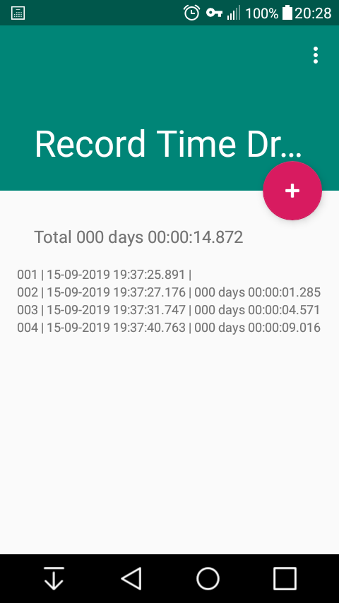
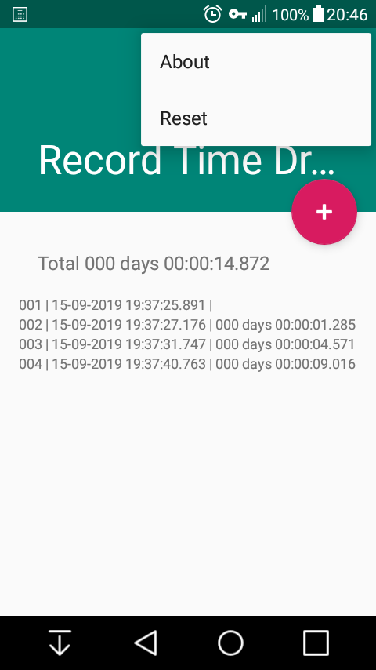
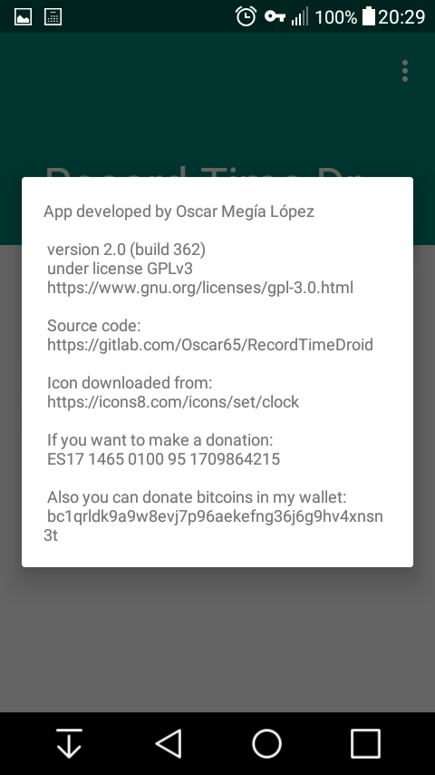
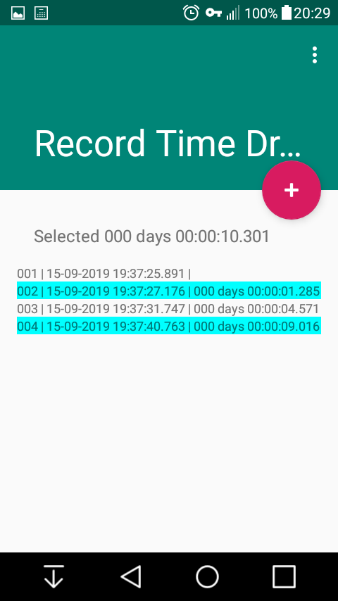

# RecordTimeDroid

This is an Android app to record time and show elapsed time between previously recorded line.

You can select lines and on top you will see the sum of elapsed times.

These are some app screenshots:

Main screen:

Menu:

Screen about:

Selected lines:

